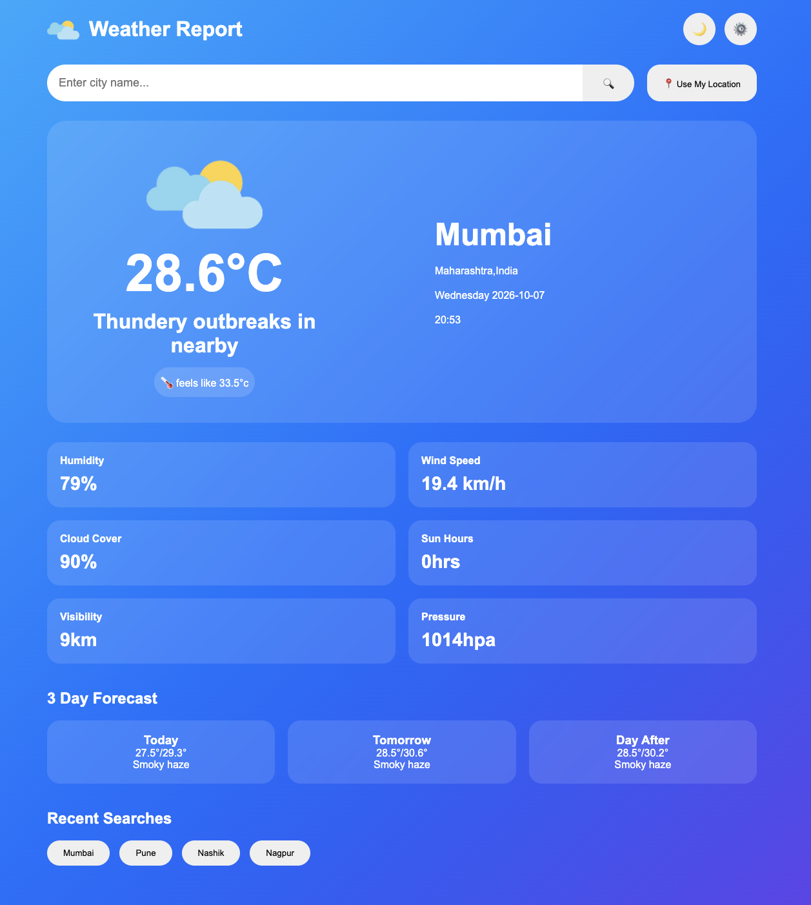

# 🌤️ Weather App

A beginner-friendly weather application built using HTML, CSS and JavaScript.

## ✨ Features

- 🔍 Search for weather by city
- 🌡️ Display temperature
- 🌤️ Display weather condition
- 🤗 Display feels-like temperature
- 💧 Display humidity
- 💨 Display wind information
- ☁️ Display cloud information
- 📍 Use current location
- 🌙 Dark and light theme
- 🎨 Change the theme/color using the theme button

## 🚧 Features To Be Added

Some features are planned but are not implemented yet:

- ⚙️ Settings functionality
- 🕘 Recent search history
- 💾 Saving recent searches

## 🛠️ Technologies

- HTML
- CSS
- JavaScript

## 📚 What I Learned

While building this project, I practiced:

- DOM manipulation
- JavaScript events
- Functions
- User input
- Updating HTML dynamically
- CSS styling and layout
- Dark/light theme switching
- Changing styles using JavaScript
- Working with weather data

## 📸 Preview

## 🎯 Future Improvements

I plan to improve this project by adding:

- Recent search history
- Settings
- Better error handling
- More weather information
- Improved responsive design